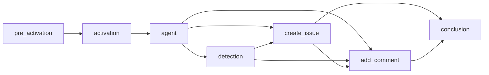
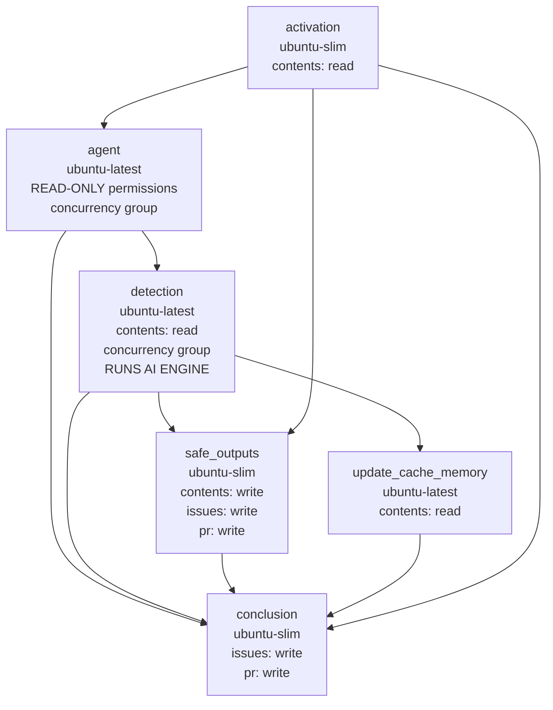

This guide documents the internal compilation process that transforms markdown workflow files into executable GitHub Actions YAML. Understanding this process helps when debugging workflows, optimizing performance, or contributing to the project.

## Overview

The `gh aw compile` command transforms a markdown workflow file into a complete GitHub Actions `.lock.yml` by embedding frontmatter and setting up runtime loading of the markdown body. The process runs five compilation phases (parsing, validation, job construction, dependency resolution, and YAML generation) described below.

When the workflow runs, the markdown body is loaded at runtime — you can edit instructions without recompilation. See [Editing Workflows](/gh-aw/guides/editing-workflows/) for details.

## Compilation Phases

### Phase 1: Parsing and Validation

The compilation process reads the markdown file and:

- Extracts YAML frontmatter
- Parses workflow configuration
- Validates against the workflow schema
- **Resolves imports** using breadth-first search (BFS) traversal
- **Merges configurations** from imported files according to field-specific rules
- Validates expression safety (only allowed GitHub Actions expressions)

#### Import Resolution Algorithm

Import processing follows a deterministic BFS algorithm:

1. **Queue initialization**: Parse main workflow's `imports:` field and add entries to queue
2. **Iterative processing**: For each import in queue:
   - Resolve path (local file or remote repository reference)
   - Load and parse import file
   - Extract mergeable configurations (tools, mcp-servers, network, etc.)
   - Add import's own imports to end of queue (nested imports)
   - Track visited files to detect circular imports
3. **Configuration accumulation**: Collect all configurations by field type
4. **Merge execution**: Apply field-specific merge strategies
5. **Validation**: Check for conflicts and permission requirements

**Merge strategies**:
- **Tools**: Deep merge with array concatenation and deduplication
- **MCP servers**: Imported servers override main workflow servers with same name
- **Network**: Union of allowed domains, deduplicated and sorted
- **Permissions**: Validation only - main must satisfy imported requirements
- **Safe outputs**: Main workflow overrides imported configurations per type
- **Runtimes**: Main workflow versions override imported versions

**Example processing order**:
```
Main Workflow
├── import-a.md          → Processed 1st
│   ├── nested-1.md      → Processed 3rd (after import-b)
│   └── nested-2.md      → Processed 4th
└── import-b.md          → Processed 2nd
    └── nested-3.md      → Processed 5th
```

See [Imports Reference](/gh-aw/reference/imports/) for complete merge semantics.

### Phases 2–5: Building the Workflow

| Phase | Steps |
|-------|-------|
| **2 Job Construction** | Builds specialized jobs: pre-activation (if needed), activation, agent, safe outputs, safe-jobs, and custom jobs |
| **3 Dependency Resolution** | Validates job dependencies, detects circular references, computes topological order, generates Mermaid graph |
| **4 Action Pinning** | Pins all actions to SHAs: check cache → GitHub API → embedded pins → add version comment (e.g., `actions/checkout@sha # v6`) |
| **5 YAML Generation** | Assembles final `.lock.yml`: header with metadata, Mermaid dependency graph, alphabetical jobs, embedded original prompt |

## Job Types

The compilation process generates specialized jobs based on workflow configuration:

| Job | Trigger | Purpose | Key Dependencies |
|-----|---------|---------|------------------|
| **pre_activation** | Role checks, stop-after deadlines, skip-if-match, or command triggers | Validates permissions, deadlines, and conditions before AI execution | None (runs first) |
| **activation** | Always | Prepares workflow context, sanitizes event text, validates lock file freshness | `pre_activation` (if exists) |
| **agent** | Always | Core job that executes AI agent with configured engine, tools, and Model Context Protocol (MCP) servers | `activation` |
| **detection** | `safe-outputs.threat-detection:` configured | Scans agent output for security threats before processing | `agent` |
| **Safe output jobs** | Corresponding `safe-outputs.*:` configured | Process agent output to perform GitHub API operations (create issues/PRs, add comments, upload assets, etc.) | `agent`, `detection` (if exists) |
| **conclusion** | Always (if safe outputs exist) | Aggregates results and generates workflow summary | All safe output jobs |

### Agent Job Steps

The agent job orchestrates AI execution through these phases:

1. Repository checkout and runtime setup (Node.js, Python, Go)
2. Cache restoration for persistent memory
3. MCP server container initialization
4. Prompt generation from markdown content
5. Engine execution (Copilot, Claude, or Codex)
6. Output upload as GitHub Actions artifact
7. Cache persistence for next run

Environment variables include `GH_AW_PROMPT` (prompt file), `GH_AW_SAFE_OUTPUTS` (output JSON), and `GITHUB_TOKEN`.

### Safe Output Jobs

Each safe output type (create issue, add comment, create PR, etc.) follows a consistent pattern: download agent artifact, parse JSON output, execute GitHub API operations with appropriate permissions, and link to related items.

Common safe output jobs:
- **create_issue** / **create_discussion** - Create GitHub items with labels and prefixes
- **add_comment** - Comment on issues/PRs with links to created items
- **create_pull_request** - Apply git patches, create branch, open PR
- **create_pr_review_comment** - Add line-specific code review comments
- **create_code_scanning_alert** - Submit SARIF security findings
- **add_labels** / **assign_milestone** - Manage issue metadata
- **update_issue** / **update_release** - Modify existing items
- **push_to_pr_branch** / **upload_assets** - Handle file operations
- **update_project** - Sync with project boards
- **missing_tool** / **noop** - Report issues or log status

### Custom Jobs

Use `safe-outputs.jobs:` for custom jobs with full GitHub Actions syntax, or `jobs:` for additional workflow jobs with user-defined dependencies. See [Deterministic & Agentic Patterns](/gh-aw/guides/deterministic-agentic-patterns/) for examples of multi-stage workflows combining deterministic computation with AI reasoning.

## Job Dependency Graphs

Jobs execute in topological order based on dependencies. Here's a comprehensive example:



**Execution flow**: Pre-activation validates permissions → Activation prepares context → Agent executes AI → Detection scans output → Safe outputs run in parallel → Add comment waits for created items → Conclusion summarizes results. Safe output jobs without cross-dependencies run concurrently; when threat detection is enabled, safe outputs depend on both agent and detection jobs.

## Why Detection, Safe Outputs, and Conclusion Are Separate Jobs

A typical compiled workflow contains these post-agent jobs:



These three jobs form a **sequential security pipeline** and cannot be combined into a single job for the following reasons.

### 1. Security Architecture: Trust Boundaries

The system enforces [Plan-Level Trust](/gh-aw/introduction/architecture/) — separating AI reasoning (read-only) from write operations. The **detection** job runs its own AI engine as a security gate: `success == 'true'` is the explicit condition controlling whether `safe_outputs` executes at all. If combined, a compromised agent's output could bypass detection.

### 2. Job-Level Permissions Are Immutable

In GitHub Actions, permissions are declared per-job and cannot change during execution:

| Job | Key Permissions | Rationale |
|-----|----------------|-----------|
| **detection** | `contents: read` (minimal) | Runs AI analysis — must NOT have write access |
| **safe_outputs** | `contents: write`, `issues: write`, `pull-requests: write` | Executes GitHub API write operations |
| **conclusion** | `issues: write`, `pull-requests: write`, `discussions: write` | Updates comments, handles failures |

If detection and safe_outputs were combined, the combined job would hold **write permissions during threat detection**, violating least privilege. A compromised detection step could exploit those write permissions.

### 3. Job-Level Gating Provides Hard Isolation

The `safe_outputs` job condition (`needs.detection.outputs.success == 'true'`) ensures the runner **never starts** if detection fails — write-permission code never loads. Step-level `if` conditions within a single job provide weaker isolation.

### 4. The Conclusion Job Requires `always()` Semantics

The `conclusion` job uses `always()` to handle upstream failures: agent errors, no-op logging, error status updates, and missing tool reporting. As a separate job it inspects upstream results via `needs.agent.result`; merging it with safe_outputs would block these steps when writes fail.

### 5. Different Runners and Resource Requirements

Detection requires `ubuntu-latest` for AI execution; safe_outputs and conclusion use the lightweight `ubuntu-slim`. Merging detection with safe_outputs would force `ubuntu-latest` for the entire pipeline.

### 6. Concurrency Group Isolation

The `detection` job shares a **concurrency group** (`gh-aw-copilot-${{ github.workflow }}`) with the agent job, serializing AI engine execution. The `safe_outputs` job intentionally does **not** have this group — it can run concurrently with other workflow instances' detection phases.

### 7. Artifact-Based Security Handoff

Data flows via GitHub Actions artifacts: agent writes `agent_output.json` → detection analyzes it and outputs `success` → safe_outputs downloads it only if approved. This prevents the output tampering possible with a shared filesystem in a single job.

## Action Pinning

All GitHub Actions are pinned to commit SHAs (e.g., `actions/checkout@b4ffde6...11 # v6`) to prevent supply chain attacks. Tags can be moved to malicious commits, but SHA commits are immutable. The resolution order mirrors Phase 4: cache (`.github/aw/actions-lock.json`) → GitHub API → embedded pins.

### The actions-lock.json Cache

`.github/aw/actions-lock.json` stores resolved `action@version` → SHA mappings so that compilation produces consistent results regardless of the token available. Resolving a version tag to a SHA requires querying the GitHub API, which can fail when the token has limited permissions — notably when compiling via GitHub Copilot Coding Agent (CCA), which uses a restricted token that may not have access to external repositories.

By caching SHA resolutions from a prior compilation (done with a user PAT or a GitHub Actions token with broader scope), subsequent compilations reuse those SHAs without making API calls. Without the cache, compilation is unstable: it succeeds with a permissive token but fails when token access is restricted.

**Commit `actions-lock.json` to version control.** This ensures all contributors and automated tools, including CCA, use the same immutable pins. Refresh it periodically with `gh aw update-actions`, or delete it and recompile with an appropriate token to force full re-resolution.

## The gh-aw-actions Repository

`github/gh-aw-actions` is the GitHub Actions repository containing all reusable actions that power compiled agentic workflows. When `gh aw compile` generates a `.lock.yml`, every action step references `github/gh-aw-actions` using a ref (typically a commit SHA, but may be a stable version tag such as `v0` when SHA resolution is unavailable):

```yaml
uses: github/gh-aw-actions/setup@abc1234...
```

These references are generated entirely by the compiler and should never be edited manually in `.lock.yml` files. To update action refs to a newer `gh-aw-actions` release, run `gh aw compile` or `gh aw update-actions`.

The repository is referenced via the `--actions-repo` flag default (`github/gh-aw-actions`) when `--action-mode action` is set during compilation. See [Compilation Commands](#compilation-commands) for how to compile against a fork or specific tag during development.

### Dependabot and gh-aw-actions

Dependabot scans all `.yml` files in `.github/workflows/` for action references and may open pull requests attempting to update `github/gh-aw-actions` to a newer SHA. **Do not merge these PRs.** The correct way to update `gh-aw-actions` pins is by running `gh aw compile` (or `gh aw update-actions`), which regenerates all action pins consistently across all compiled workflows from a single coordinated release.

To suppress Dependabot PRs for `github/gh-aw-actions`, add an `ignore` entry in `.github/dependabot.yml`:

```yaml
updates:
  - package-ecosystem: github-actions
    directory: "/"
    ignore:
      # ignore updates to gh-aw-actions, which only appears in auto-generated *.lock.yml
      # files managed by 'gh aw compile' and should not be touched by dependabot
      - dependency-name: "github/gh-aw-actions"
```

This tells Dependabot to skip version updates for `github/gh-aw-actions` while still monitoring all other GitHub Actions dependencies.

## Artifacts Created

Workflows generate several artifacts during execution:

| Artifact | Location | Purpose | Lifecycle |
|----------|----------|---------|-----------|
| **agent_output.json** | `/tmp/gh-aw/safeoutputs/` | AI agent output with structured safe output data (create_issue, add_comment, etc.) | Uploaded by agent job, downloaded by safe output jobs, auto-deleted after 90 days |
| **agent_usage.json** | `/tmp/gh-aw/` | Aggregated token counts: `{"input_tokens":…,"output_tokens":…,"cache_read_tokens":…,"cache_write_tokens":…}` | Bundled in the unified agent artifact when the firewall is enabled; accessible to third-party tools without parsing step summaries |
| **prompt.txt** | `/tmp/gh-aw/aw-prompts/` | Generated prompt sent to AI agent (includes markdown instructions, imports, context variables) | Retained for debugging and reproduction |
| **firewall-audit-logs** | See structure below | Dedicated artifact for AWF audit/observability logs (token usage, network policy, audit trail) | Uploaded by all firewall-enabled workflows; analyzed by `gh aw logs --artifacts firewall` |
| **firewall-logs/** | `/tmp/gh-aw/sandbox/firewall/logs/` | Network access logs in Squid format (when `network.firewall:` enabled) | Analyzed by `gh aw logs` command |
| **cache-memory/** | `/tmp/gh-aw/cache-memory/` | Persistent agent memory across runs (when `tools.cache-memory:` configured) | Restored at start, saved at end via GitHub Actions cache |
| **patches/**, **sarif/**, **metadata/** | Various | Safe output data (git patches, SARIF files, metadata JSON) | Temporary, cleaned after processing |

### `firewall-audit-logs` Artifact Structure

The `firewall-audit-logs` artifact is a dedicated multi-file artifact uploaded by all firewall-enabled workflows. It is **separate** from the unified `agent` artifact. Downstream workflows that need token usage data or firewall audit logs must download this artifact specifically.

```
firewall-audit-logs/
├── api-proxy-logs/
│   └── token-usage.jsonl        ← Token usage data per request
├── squid-logs/
│   └── access.log               ← Network policy log (allow/deny)
├── audit.jsonl                  ← Firewall audit trail
└── policy-manifest.json         ← Policy configuration snapshot
```

> **Tip:** Use `gh aw logs <run-id> --artifacts firewall` to download and analyze firewall data instead of `gh run download` directly. The CLI handles artifact naming and backward compatibility automatically. See the [Artifacts reference](/gh-aw/reference/artifacts/) for the complete artifact naming guide.

## MCP Server Integration

Model Context Protocol (MCP) servers provide tools to AI agents. Compilation generates `mcp-config.json` from workflow configuration.

**Local MCP servers** run in Docker containers with auto-generated Dockerfiles. Secrets inject via environment variables, and engines connect via stdio.

**HTTP MCP servers** require no containers. Engines connect directly with configured headers and authentication.

**Tool filtering** via `allowed:` restricts agent access to specific MCP tools. Environment variables inject through Dockerfiles (local) or config references (HTTP).

**Agent job integration**: MCP containers start after runtime setup → Engine executes with tool access → Containers stop after completion.

## Pre-Activation Job

Pre-activation enforces security and operational policies before expensive AI execution. It validates permissions, deadlines, and conditions, setting `activated=false` to skip downstream jobs when checks fail.

**Validation types**:
- **Role checks** (`roles:`): Verify actor has required permissions (admin, maintainer, write)
- **Stop-after** (`on.stop-after:`): Honor time-limited workflows (e.g., `+30d`, `2024-12-31`)
- **Skip-if-match** (`skip-if-match:`): Prevent duplicates by searching for existing items matching criteria
- **Command position** (`on.slash_command:`): Ensure command appears in first 3 lines to avoid accidental triggers

Pre-activation runs checks sequentially. Any failure sets `activated=false`, preventing AI execution and saving costs.

## Compilation Commands

| Command | Description |
|---------|-------------|
| `gh aw compile` | Compile all workflows in `.github/workflows/` |
| `gh aw compile my-workflow` | Compile specific workflow |
| `gh aw compile --verbose` | Enable verbose output |
| `gh aw compile --strict` | Enhanced security validation |
| `gh aw compile --no-emit` | Validate without generating files |
| `gh aw compile --actionlint --zizmor --poutine` | Run security scanners |
| `gh aw compile --purge` | Remove orphaned `.lock.yml` files |
| `gh aw compile --output /path/to/output` | Custom output directory |
| `gh aw compile --action-mode action --actions-repo owner/repo` | Compile using a custom actions repository (requires `--action-mode action`) |
| `gh aw compile --action-mode action --actions-repo owner/repo --action-tag branch-or-sha` | Compile against a specific branch or SHA in a fork |
| `gh aw compile --action-tag v1.2.3` | Pin action references to a specific tag or SHA (implies release mode) |
| `gh aw validate` | Validate all workflows (compile + all linters, no file output) |
| `gh aw validate my-workflow` | Validate a specific workflow |
| `gh aw validate --json` | Validate and output results in JSON format |
| `gh aw validate --strict` | Validate with strict mode enforced |

> [!TIP]
> Compilation is only required when changing **frontmatter configuration**. The **markdown body** (AI instructions) is loaded at runtime and can be edited without recompilation. See [Editing Workflows](/gh-aw/guides/editing-workflows/) for details.

> [!NOTE]
> The `--actions-repo` flag overrides the default `github/gh-aw-actions` repository used when `--action-mode action` is set. Use it together with `--action-tag` to compile against a branch or fork during development.

## Debugging Compilation

**Enable verbose logging**: `DEBUG=workflow:* gh aw compile my-workflow --verbose` shows job creation, action pin resolutions, tool configurations, and MCP setups.

**Inspect `.lock.yml` files**: Check header comments (imports, dependencies, prompt), job dependency graphs (Mermaid diagrams), job structure (steps, environment, permissions), action SHA pinning, and MCP configurations.

**Common issues**: Circular deps → review `needs:` clauses; Missing action pin → add to `action_pins.json` or enable dynamic resolution; Invalid MCP config → verify `command`, `args`, `env`.

## Performance Optimization

**Compilation speed**: Simple workflows compile in ~100ms, complex workflows with imports in ~500ms, and workflows with dynamic action resolution in ~2s. Optimize by using action cache (`.github/aw/actions-lock.json`), minimizing import depth, and pre-compiling shared workflows.

**Runtime performance**: Safe output jobs without dependencies run in parallel. Enable `cache:` for dependencies, use `cache-memory:` for persistent agent memory, and cache action resolutions for faster compilation.

## Advanced Topics

**Custom engine integration**: Create engines that return GitHub Actions steps, provide environment variables, and configure tool access. Register with the framework for workflow availability.

**Schema extension**: Add frontmatter fields by updating the workflow schema, rebuilding (`make build`), adding parser handling, and updating documentation.

**Workflow manifest resolution**: Compilation tracks imported files in lock file headers for dependency tracking, update detection, and audit trails.

## Best Practices

**Security**: Always use action pinning (never floating tags), enable threat detection (`safe-outputs.threat-detection:`), limit tool access with `allowed:`, review generated `.lock.yml` files, and run security scanners (`--actionlint --zizmor --poutine`).

**Maintainability**: Use imports for shared configuration, document complex workflows with `description:`, compile frequently during development, version control lock files and action pins (`.github/aw/actions-lock.json`).

**Performance**: Enable caching (`cache:` and `cache-memory:`), minimize imports to essentials, optimize tool configurations with restricted `allowed:` lists, use safe-jobs for custom logic.

**Debugging**: Enable verbose logging (`--verbose`), check job dependency graphs in headers, inspect artifacts and firewall logs (`gh aw logs`), validate without file generation (`--no-emit`).

## Related Documentation

- [Editing Workflows](/gh-aw/guides/editing-workflows/) - When to recompile vs edit directly
- [Frontmatter Reference](/gh-aw/reference/frontmatter/) - All configuration options
- [Tools Reference](/gh-aw/reference/tools/) - Tool configuration guide
- [Safe Outputs Reference](/gh-aw/reference/safe-outputs/) - Output processing
- [Engines Reference](/gh-aw/reference/engines/) - AI engine configuration
- [Network Reference](/gh-aw/reference/network/) - Network permissions
